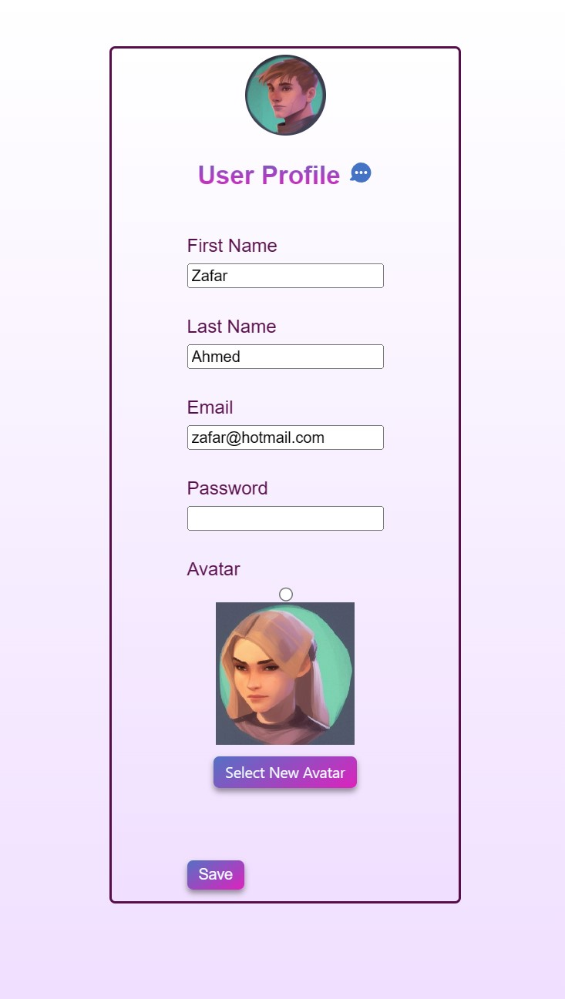

# ThoughtBook

## Table of Contents
- [Project Description](#project-description)
- [Usage](#usage)
- [Technologies used](#technologies-used)
- [User Story](#user-story)
- [Acceptance Criteria](#acceptance-criteria)
- [License](#license)

## Project Description
The Social Media Thought Book AI Picture Generator is an API that allows users of a social media startup to express their emotions through generated pictures created by AI. The API enables users to enter a short sentence expressing their feelings and generate a picture that reflects those emotions. Users can write how they feel about the generated picture and post both the picture and their thoughts to the social media thought book platform.

## Website Link
https://thought-book.herokuapp.com/

## GitHub Link
https://github.com/zafarfast/tp043234nf4642

## Technologies used:
- React
- GraphQL
- Node
- Express
- Apollo Client
- Mongoose
- JWT
- OpenAI
- Heroku
- Email Validator
- Stripe
- .env

## Project Team
- Zafar Ahmed
- Bryan Seng
- Anna Marcus

**User Story**
- As a user of the social media thought book platform
- I want to be able to express my emotions through generated pictures created by AI
- When I enter a short sentence expressing my feelings into the platform, I want the API to generate a picture that reflects my emotions
- Then, I want to be able to write how I feel about the generated picture and post both the picture and my thoughts to the social media thought book platform
- I expect the API to handle any errors that may occur during the process and provide clear error messages to me. By having this functionality, I can better express my emotions and connect with others on the platform who may share similar feelings.

**Acceptance Criteria**
- GIVEN a social media AI network
- When I enter a short sentence expressing my emotions into the social media thought book platform
- Then the API should generate a picture using AI that reflects the emotions expressed in my sentence
- When I write how I feel about the generated picture
- Then the API should allow me to post both the generated picture and my thoughts to the social media thought book platform. 

## Screenshots

### Desktop View

### Mobile View

## License
- 
